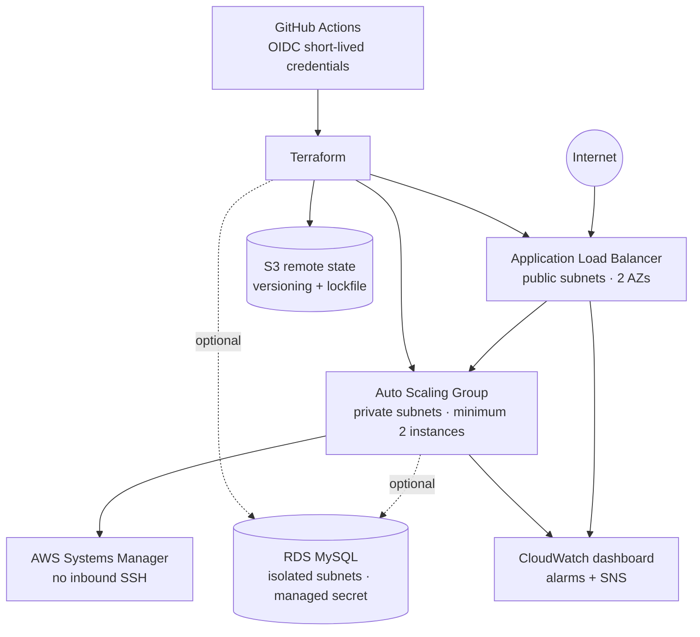

# Terraform AWS High-Availability Web Platform

[](https://github.com/jeevanm84/terraform-aws-ha-web-platform/actions/workflows/terraform-ci.yml)
[](https://developer.hashicorp.com/terraform)
[](LICENSE)

A practical, safety-first Terraform learning repository that builds a two-Availability-Zone AWS web platform. Start with fully offline validation and mocked tests; connect an AWS account only when you intentionally choose to deploy.

> **No AWS account is required for Modules 1–5.** Nothing in this repository deploys automatically. AWS plan, apply, and destroy workflows are manual and separated by GitHub environments.

## What you will build



The default learning profile provides real multi-AZ compute with two instances. It uses one NAT gateway to limit cost and leaves RDS disabled. The resilience profile uses one NAT gateway per AZ and optional Multi-AZ RDS.

## Choose your path

| Level | Complete | Outcome |
|---|---|---|
| Beginner | Modules 1–5 in the [end-to-end guide](docs/END_TO_END_GUIDE.md) | Understand Terraform structure, format, validate, and run tests without AWS |
| Intermediate | Modules 6–9 | Bootstrap state and OIDC, review a real plan, deploy, verify, and clean up |
| Advanced | Architecture decisions, modules, tests, and extensions | Evaluate availability, IAM, state, observability, cost, and production gaps |

## Five-minute offline start

Prerequisites: Git and Terraform `>= 1.10`.

```bash
git clone https://github.com/jeevanm84/terraform-aws-ha-web-platform.git
cd terraform-aws-ha-web-platform
./scripts/verify-tools.sh
./scripts/check.sh
```

Expected final message:

```text
All offline checks passed. No AWS resources were created.
```

This command formats-checks the repository, initializes only provider plugins, validates HCL, and runs mocked provider tests. It does not call AWS APIs.

## Repository map

```text
terraform-aws-ha-web-platform/
├── bootstrap/
│   ├── state/                 # Versioned, encrypted S3 backend
│   └── github-oidc/           # Short-lived GitHub-to-AWS roles
├── environments/learning/     # Runnable root module and mock tests
├── modules/
│   ├── networking/            # VPC, six subnets, routes, NAT choices
│   ├── load-balancer/         # ALB, listeners, target group, ingress
│   ├── compute/               # Launch template, ASG, SSM, IMDSv2
│   ├── database/              # Optional isolated RDS with managed secret
│   └── observability/         # Dashboard, alarms, SNS
├── docs/                      # Guided labs and design explanations
├── scripts/                   # Repeatable offline verification
└── .github/workflows/         # CI and manual AWS workflows
```

See [Code structure and execution flow](docs/CODE_STRUCTURE.md) for the dependency graph and file-by-file navigation.

## Design highlights

- Two AZs, separate public/private/database subnet tiers, and a minimum of two web instances.
- No public instance IPs or SSH ingress; administration uses Systems Manager.
- IMDSv2 required, encrypted EBS and RDS storage, and credentials managed by Secrets Manager.
- S3 state with native lockfiles (`use_lockfile = true`), versioning, encryption, and public-access blocking.
- GitHub OIDC with immutable account/repository identity claims; no stored AWS access keys.
- Saved-plan apply and destroy workflows with typed confirmation and protected environments.
- Mock provider tests that exercise cost-aware and resilience profiles without cloud credentials.
- RDS disabled by default, explicit cost profiles, and a cleanup runbook.

## Documentation

- [End-to-end guide](docs/END_TO_END_GUIDE.md) — the single document to follow from clone through cleanup
- [Architecture](docs/ARCHITECTURE.md) — components, traffic flow, trust boundaries, and trade-offs
- [Code structure](docs/CODE_STRUCTURE.md) — how Terraform evaluates this repository
- [Cost and cleanup](docs/COST_AND_CLEANUP.md) — cost drivers and safe teardown sequence
- [Troubleshooting](docs/TROUBLESHOOTING.md) — common errors organized by stage
- [Interview practice](docs/INTERVIEW_QUESTIONS.md) — explanations and scenario prompts

## Important boundaries

This is a learning reference, not a turnkey production platform. Before production use, add organization-specific DNS, WAF, KMS keys, centralized logging, policy-as-code, service control policies, backup/restore tests, disaster recovery targets, and a reviewed least-privilege IAM policy.

## Portfolio roadmap

This repository is the infrastructure-as-code stage of the [jeevanm84 engineering portfolio](https://github.com/jeevanm84):

```text
Git foundations → Terraform infrastructure → Packer images
→ Kubernetes platform engineering → MJCart capstone
```

- Prerequisite: [Git Command Master Map](https://github.com/jeevanm84/git-command-master-map)
- Next: [Packer AWS Golden Image Pipeline](https://github.com/jeevanm84/packer-aws-golden-image-pipeline)
- Platform stage: [Kubernetes Zero to Production](https://github.com/jeevanm84/kubernetes-zero-to-production)
- Capstone: [MJCart E-commerce Microservices](https://github.com/jeevanm84/mjcart-ecommerce-microservices)

## Contributing and security

Contributions are welcome; read [CONTRIBUTING.md](CONTRIBUTING.md). Report vulnerabilities privately using the process in [SECURITY.md](SECURITY.md). Never post credentials, Terraform state, plan files, or real AWS account details.

Maintained by [@jeevanm84](https://github.com/jeevanm84) · [MIT License](LICENSE)
