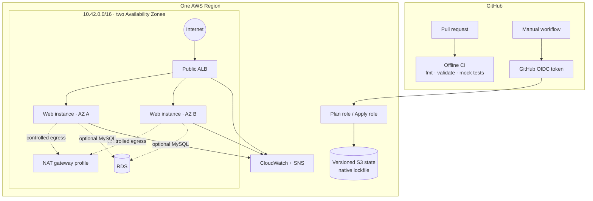
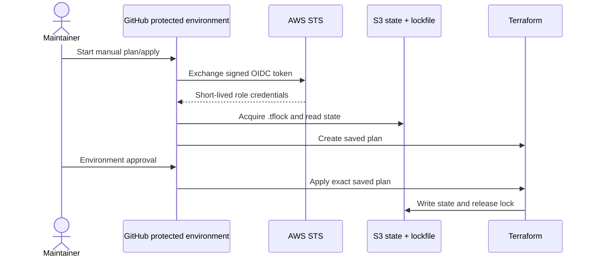

# Architecture

## System view

## Network tiers

| Tier | Resources | Internet route | Inbound rule |
|---|---|---|---|
| Public | ALB, NAT gateway/EIP | Internet gateway | Configured public CIDRs to 80/443 |
| Private compute | Auto Scaling instances | NAT for outbound only | Application port from ALB security group |
| Isolated database | Optional RDS | None | MySQL from compute security group |

Security groups reference other security groups where possible, so changing instance addresses does not require rule changes. No instance exposes SSH. Systems Manager provides authenticated, audited administration through the EC2 role.

## Availability profiles

| Concern | Learning profile | Resilience profile |
|---|---|---|
| ALB | Two AZs | Two AZs |
| Web capacity | Minimum two | Minimum two |
| NAT | One shared gateway | One gateway per AZ |
| RDS | Disabled | Optional Multi-AZ |
| Cost | Lower | Higher |

A single NAT gateway is a cost optimization, not a fully highly available egress design. The application can continue serving existing traffic if an instance fails, but private instances in the other AZ can lose outbound package/service access if the single NAT path is unavailable.

## State and deployment trust

The plan and apply roles trust different GitHub environment subjects. The subject includes immutable owner and repository IDs as well as names. State access is limited to this repository's key prefix.

## Production gaps to evaluate

The repository demonstrates sound patterns but cannot know an organization's requirements. Production evaluation should cover Route 53 and ACM lifecycle, AWS WAF, customer-managed KMS keys, VPC endpoints, centralized logs, secrets rotation consumers, database parameter groups, restore tests, scaling policies, load tests, organization policy, drift detection, separate accounts, and tested recovery objectives.
