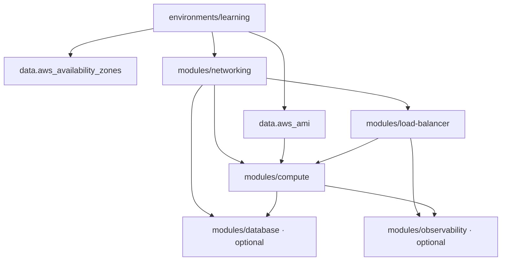

# Code structure and execution flow

## Dependency graph



Terraform reads every `.tf` file in a directory as one module. Filenames help humans navigate; data and resource references decide evaluation order.

## Root module

| File | Responsibility |
|---|---|
| `versions.tf` | Terraform and AWS provider compatibility |
| `backend.tf` | Partial S3 backend, encryption, and native lockfile |
| `providers.tf` | AWS region and default tags |
| `variables.tf` | Public inputs, defaults, descriptions, validation |
| `locals.tf` | Shared names and tags |
| `data.tf` | Available AZs and latest Amazon Linux 2023 AMI |
| `main.tf` | Child-module wiring and cross-module dependencies |
| `outputs.tf` | Safe operational results |
| `tests/platform.tftest.hcl` | Mocked plans for learning and HA profiles |

## Module contracts

- `networking` returns ordered subnet IDs and NAT count.
- `load-balancer` consumes public subnet IDs and returns its security group, target group, DNS, and metric suffixes.
- `compute` consumes private subnet IDs plus ALB outputs and returns its security group and Auto Scaling name.
- `database` consumes isolated subnet IDs and the compute security group. The root creates it only when enabled.
- `observability` consumes ALB/target-group suffixes and the Auto Scaling name. The root creates it only when enabled.

This output-to-input flow creates explicit dependencies without `depends_on` at the root.

## Pipeline flow

```text
pull request / push
  └─ Terraform CI
      ├─ fmt -check
      ├─ init -backend=false
      ├─ validate
      └─ test with mock_provider (no AWS)

manual AWS Plan
  └─ aws-plan environment → OIDC plan role → remote state → plan only

manual AWS Apply
  └─ typed APPLY → aws-apply approval → OIDC apply role
      └─ create saved plan → apply that exact plan

manual AWS Destroy
  └─ typed DESTROY → aws-apply approval → saved destroy plan → apply
```

## Extension workflow

When adding a capability, begin with a small module contract, wire it in the root, add a mock assertion, document cost/security effects, and run `./scripts/check.sh`. Avoid making a module depend directly on another module; pass only the required values from the root.
